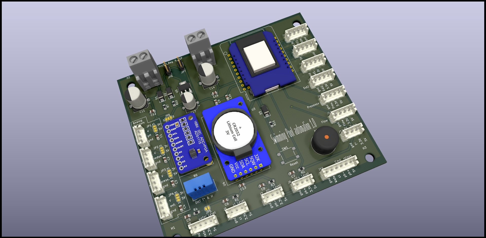

# AutoPool

ESP32 swimming-pool controller with pH / ORP / filter automation, Nextion touch UI, web dashboard, MQTT, and native Home Assistant autodiscovery.



AutoPool runs unattended on the side of the pool: it schedules the filter pump, doses chlorine on ORP, holds pH inside a target band by injecting acid (and optionally base) through peristaltic pumps, watches tank levels, and exposes everything over a 5″ touch panel, a web UI, and MQTT.

---

## Table of contents

- [Features](#features)
- [Hardware](#hardware)
- [Architecture](#architecture)
- [Build, flash and first boot](#build-flash-and-first-boot)
- [Configuration](#configuration)
- [MQTT](#mqtt)
- [Home Assistant integration](#home-assistant-integration)
- [Web UI and Nextion display](#web-ui-and-nextion-display)
- [OTA, CLI and Telnet](#ota-cli-and-telnet)
- [ESPHome alternative](#esphome-alternative)
- [Repository layout](#repository-layout)
- [Credits and license](#credits-and-license)

---

## Features

**Regulation**
- Filter pump scheduling — 24-hour fixed bitmap or per-temperature program (selected by `filter_auto_mode`)
- Filter speed control (FULL / REG) on a variable-speed pump
- Periodic short-cycle filter run for stagnation prevention
- pH minus (and optional pH plus) dosing on a fixed regulation cycle, proportional to deviation from target
- ORP / chlorine dosing on a fixed regulation cycle with daily mL caps
- Daily injection counters with automatic midnight reset (preserved across soft resets via RTC slow memory)

**Sensing**
- DS18B20 — water temperature (OneWire)
- DHT22 — air temperature and humidity inside the enclosure
- ADS1115 — pH probe, ORP probe, and pump-loop pressure transducer (3 channels)
- DS3231 — battery-backed RTC
- Four float switches — water level + Cl / pH- / pH+ tank levels

**Interfaces**
- Nextion 5″ resistive touch panel (`hmi/auto_pool_ui.HMI`)
- Responsive web dashboard served from SPIFFS (`http://<ip>/`)
- MQTT — measures, states, parameters, log, command, with **Home Assistant autodiscovery** (~40 entities) and LWT availability
- Serial CLI (`SimpleCLI`)
- OTA — firmware, SPIFFS filesystem, and Nextion display

---

## Hardware

The full schematic and PCB live in [`hardware/`](hardware/):

- [`hardware/autopool.pdf`](hardware/autopool.pdf) — schematic
- [`hardware/autopool.kicad_pcb`](hardware/autopool.kicad_pcb) — KiCad PCB
- [`hardware/autopool.png`](hardware/autopool.png), [`autopool_3.png`](hardware/autopool_3.png) — board renders
- [`3D/`](3D/) — printable enclosure parts (STL / STEP)

### Bill of materials (top level)

| Block | Part |
|---|---|
| MCU | ESP32 dev module |
| Display | Nextion 5″ (NX8048T050 or compatible) |
| Analog frontend | ADS1115 (I²C) for pH / ORP / pressure |
| RTC | DS3231 (I²C, battery-backed) |
| Air sensor | DHT22 |
| Water sensor | DS18B20 (OneWire) |
| Filter pump driver | Solid-state relay (active-high) |
| Dosing | 3× peristaltic pumps (Cl, pH-, pH+) on relays (active-low) |
| Levels | 4× float switches (water, Cl, pH-, pH+) |
| Misc | Piezo buzzer, two status LEDs |

### Pin map (excerpt, see [`src/board.h`](src/board.h) for the source of truth)

| Function | GPIO | Notes |
|---|---|---|
| Filter pump SSR | `PIN_EXT1` (14) | active **high** (`PUMP_FILTER_ACTIVE_VALUE = true`) |
| Filter speed (FULL/REG) | `PIN_EXT2` (15) | optional, gated by `HAS_FILTER_PWR_CTRL` |
| Cl pump relay | 25 | active **low** (`PUMP_ACTIVE_VALUE = false`) |
| pH- pump relay | 32 | active low |
| pH+ pump relay | 4 | active low, gated by `HAS_PH_PLUS_PUMP` |
| DS18B20 (water temp) | 13 | OneWire |
| DHT22 | 18 | |
| I²C (ADS1115, DS3231) | 21 / 22 | SDA / SCL |
| Nextion display | 16 / 17 | `Serial2` RX / TX, 115 200 baud |
| Float switches | 34, 35, 36, 39 | water / Cl / pH- / pH+ (input-only pins) |
| Buzzer | 5 | |

> **Polarity matters.** The filter pump SSR is wired through `PIN_EXT1` and is active-high; the dosing relays are active-low. Always go through the helpers in `board.h` (`pump_filtration_on/off`, `pump_ph_minus_on/off`, …) — never `digitalWrite` directly from feature code.

---

## Architecture

```
                    ┌────────────────────────┐
                    │       main.cpp         │
                    │  setup() / loop()      │
                    └──────────┬─────────────┘
                               │ SoftTimer ticks
        ┌──────────────┬───────┴───────┬──────────────┐
        ▼              ▼               ▼              ▼
  filter_control   ph_control     orp_control     measures
   (state machine) (state machine)(state machine) (sensor reads)
        │              │               │              │
        └────────┬─────┴────────┬──────┴──────┬───────┘
                 ▼              ▼             ▼
              board.h        state.h     parameters.h
            (HW helpers)   (live state)  (persisted setpoints)
                 │              │             │
                 ▼              ▼             ▼
        ┌────────────────────────────────────────────┐
        │   display  │  mqtt  │  server  │  cli  │ ota │
        └────────────────────────────────────────────┘
```

- **Cooperative scheduling** — every subsystem registers periodic work on a [`SoftTimer`](src/soft_timer.h) instance; no `delay()` in the main loop.
- **Three regulators** with explicit state machines defined in [`src/state.h`](src/state.h):
  - `filter_control_state_t` — IDLE → WARM_UP → ACTIVE → EXTENDED → PERIODIC
  - `ph_control_state_t` — IDLE / MINUS_INJECTION_{ON,OFF} / PLUS_INJECTION_{ON,OFF}
  - `orp_control_state_t` — IDLE / INJECTION_{ON,OFF}
- **Persistence** — two SPIFFS JSON files in [`data/`](data/):
  - `/config.json` ↔ `ParametersStruture` ([`src/parameters.h`](src/parameters.h))
  - `/state.json` ↔ last-known mode of each regulator (so a reboot does not reset operator intent)
- **Compile-time feature gates** in [`src/config.h`](src/config.h): `HAS_PH_CONTROL`, `HAS_ORP_CONTROL`, `HAS_FILTER_CONTROL`, `HAS_FILTER_PWR_CTRL`, `HAS_PH_PLUS_PUMP`, `HAS_MQTT`, `HAS_OTA`, `HAS_WEB_SERVER`, `HAS_CLI`, `HAS_TELNET_SERVER`, `HAS_QUIET_MEASURES`, `HAS_CUSTOM_MAC`.

---

## Build, flash and first boot

PlatformIO is the only toolchain. The single environment is `esp32dev`, defined in [`platformio.ini`](platformio.ini).

```bash
# Build
pio run

# Flash firmware over USB
pio run -t upload

# Flash firmware OTA
pio run -t upload --upload-port 192.168.x.x

# Flash the SPIFFS filesystem (web UI + config.json + state.json)
# Required after editing anything under data/
pio run -t uploadfs

# Serial monitor at 115 200 baud
pio device monitor

# Clean build
pio run -t clean
```

> **There are no unit tests** wired up. `test/autopool_tester.py` is a host-side helper, not a PlatformIO test runner.

### First boot

On first power-up the device opens a captive Wi-Fi portal named **`AUTOPOOL_CONFIG`**. Connect to it and configure:

- Wi-Fi SSID / password
- MQTT server / port / user / password
- MQTT base topic (default: `autopool`)

Settings persist to `/config.json` on SPIFFS. To re-trigger the portal later, send the `portal` CLI command on the serial console, or hit `/reboot` after wiping settings via `portal_reset`.

---

## Configuration

Three editing channels feed the same [`ParametersStruture`](src/parameters.h):

1. **Web UI** — `http://<ip>/settings.html` (form is bound by [`data/script_settings.js`](data/script_settings.js))
2. **MQTT** — publish a full JSON payload to `<base>/CMD/PARAMETERS`, or update one field at a time with `<base>/CMD/SET/<KEY>` *(see [MQTT](#mqtt))*
3. **WiFiManager portal** — for the network and broker fields only, on first boot or after `portal` / `portal_reset`

### Most-edited parameters

| Field | Meaning | Typical |
|---|---|---|
| `target_ph`, `delta_ph` | pH setpoint and dead-band | 7.4 ± 0.15 |
| `target_orp`, `delta_orp` | ORP setpoint (mV) and dead-band | 650 ± 70 |
| `flow_cl`, `flow_ph_minus`, `flow_ph_plus` | Peristaltic pump flow rate (mL/min) | 25 |
| `cl_max_day`, `phm_max_day` | Daily injection caps (mL) | 2000 |
| `pressure_warning` | Filter loop alarm threshold (bar) | 1.9 |
| `ph_offset`, `orp_offset` | Probe calibration offsets | 0 |
| `timer_prog` | 24-bit hourly bitmap for filter run | — |
| `filter_auto_mode` | `0` = bitmap, `1` = function of water temperature | 0 |
| `timer_prog_temperature[11]` | Per-temperature bitmaps (10 °C → 30 °C, step 2 °C) | — |
| `periodic_filter_time` | Seconds for short anti-stagnation cycle | 0 |
| `ha_discovery_enabled`, `ha_discovery_prefix` | HA autodiscovery toggle and topic prefix | `false`, `homeassistant` |

---

## MQTT

All topics are rooted at `<base>` (the value of `mqtt_base_topic`, default `autopool`).

### Published

| Topic | Retained | Payload |
|---|---|---|
| `<base>/AVAIL` | yes | `online` while the controller is up; `offline` published as LWT on disconnect |
| `<base>/MEAS` | no | JSON snapshot of [`MeasuresStructure`](src/measures.h) (temps, pH, ORP, pressure, levels, daily mL counters, boot count) |
| `<base>/STATE_FILTER` | no | JSON snapshot of the filter regulator state |
| `<base>/STATE_PH` | no | JSON snapshot of the pH± regulator state |
| `<base>/STATE_ORP` | no | JSON snapshot of the ORP regulator state |
| `<base>/PARAM` | no | Echo of the current `ParametersStruture` after any change |
| `<base>/LOG`, `<base>/DEBUG` | no | Free-form text |
| `<prefix>/+/autopool_<mac>/+/config` | yes | HA discovery configs (only when `ha_discovery_enabled` is set) |

### Subscribed (`<base>/CMD/<KEY>`)

**Mode commands** *(legacy string suffix, empty payload):*
`FILTER_MODE_AUTO` · `FILTER_MODE_ON` · `FILTER_MODE_OFF` · `FILTER_PWR_FULL` · `FILTER_PWR_REG` · `ORP_MODE_AUTO` · `ORP_MODE_ON` · `ORP_MODE_OFF`

**Per-field SET commands** *(payload = scalar value, suitable for HA selects/numbers):*

| Topic | Payload |
|---|---|
| `SET/FILTER_MODE` | `AUTO` \| `ON` \| `OFF` |
| `SET/FILTER_POWER` | `FULL` \| `REG` |
| `SET/ORP_MODE` | `AUTO` \| `ON` \| `OFF` |
| `SET/PH_MINUS_MODE` | `AUTO` \| `ON` \| `OFF` |
| `SET/PH_PLUS_MODE` | `AUTO` \| `ON` \| `OFF` |
| `SET/TARGET_PH`, `SET/DELTA_PH` | float |
| `SET/TARGET_ORP`, `SET/DELTA_ORP` | float (mV) |
| `SET/FLOW_CL`, `SET/FLOW_PH_MINUS`, `SET/FLOW_PH_PLUS` | float (mL/min) |
| `SET/CL_MAX_DAY`, `SET/PHM_MAX_DAY` | float (mL) |
| `SET/PRESSURE_WARNING` | float (bar) |
| `SET/PH_OFFSET`, `SET/ORP_OFFSET` | float (calibration) |
| `SET/PERIODIC_FILTER_TIME` | seconds |

Per-field SET commands persist to `/config.json` and echo on `<base>/PARAM`.

**JSON updates** *(payload = full JSON document):*
`PARAMETERS` · `MEASURES` · `FILTER_STATE` · `ORP_STATE` · `PH_STATE`

**Utility:** `RESET` · `RST_DAILY_ML_ORP` · `BEEP` · `GET_PARAMETERS` · `GET_STATES` · `LOG` · `FS`

---

## Home Assistant integration

Two paths, pick one.

### Autodiscovery (recommended)

1. Open the AutoPool web UI → **Settings** → tick **Enable autodiscovery**, leave the prefix as `homeassistant` unless your HA instance uses a custom one.
2. Click **Submit**. The controller publishes ~40 retained discovery configs under `<prefix>/+/autopool_<mac>/+/config`.
3. Home Assistant's MQTT integration picks them up automatically. AutoPool appears as a single device with:
   - Sensors — water / system temperature, humidity, pressure, pH, ORP, daily mL counters, boot count
   - Binary sensors — water level, three tank levels, four pump-running indicators
   - Selects — filter mode, filter power, ORP mode, pH± modes
   - Numbers — every setpoint listed in [Configuration](#configuration)
   - Buttons — controller reset, daily Cl counter reset
   - Diagnostic sensors — internal state of the three regulators
4. To remove the device: untick the checkbox; the controller publishes empty retained payloads to clear every discovery topic.

### Manual packages

If you'd rather not run discovery, copy the assets in [`homeassistant/`](homeassistant/) into your HA config and follow [`homeassistant/configuration_snippet.yaml`](homeassistant/configuration_snippet.yaml). It includes a ready-made package, dashboard, and Jinja templates plus mosquitto-based smoke-test commands.

---

## Web UI and Nextion display

### Web UI

Served by [`src/server.cpp`](src/server.cpp) from SPIFFS:

- `/` — live dashboard (measures, daily counters)
- `/settings.html` — full configuration form
- `/getmeasures`, `/getparameters`, `/getfilterstate`, `/getorpstate`, `/getphstate` — JSON endpoints used by the dashboard
- `/setparameters` — POST endpoint backing the settings form
- `/filter_auto`, `/filter_on`, `/filter_off`, `/filter_pwr_full`, `/filter_pwr_reg`, `/orp_*`, `/ph_*` — quick-action buttons
- `/reboot`, `/rst_daily_ml_orp` — maintenance
- `/edit`, `/list`, `/fs` — SPIFFS file browser

### Nextion display

- HMI source: [`hmi/auto_pool_ui.HMI`](hmi/auto_pool_ui.HMI) (open in Nextion Editor)
- Pre-built TFT firmware lives under [`hmi/tft/`](hmi/tft/) — flash directly from an SD card, or push over the air via [`src/ota_tft.cpp`](src/ota_tft.cpp) (uses [`lib/ESPNexUpload`](lib/ESPNexUpload))
- Display drives `Serial2` (`PIN_RX2 = 16`, `PIN_TX2 = 17`) at 115 200 baud
- Firmware references widgets by name in [`src/display_components.cpp`](src/display_components.cpp); add new touch callbacks in [`src/display.cpp`](src/display.cpp)

---

## OTA, CLI and Telnet

- **Firmware OTA** — ArduinoOTA, invoked via `pio run -t upload --upload-port <ip>`
- **Filesystem OTA** — same syntax with `-t uploadfs`
- **Display OTA** — streamed by `ESPNexUpload`, triggered from the web UI / MQTT
- **Serial CLI** — three commands today (parsed by `SimpleCLI` in [`src/cli.cpp`](src/cli.cpp)):
  - `portal` — open the Wi-Fi captive portal and reboot
  - `portal_reset` — wipe Wi-Fi credentials and reboot
  - `format` — format SPIFFS (destructive)
- **Telnet** — off by default (`HAS_TELNET_SERVER 0` in [`src/config.h`](src/config.h)); flips on a `RemoteDebug` server when enabled

---

## ESPHome alternative

[`autopool_esphome.yaml`](autopool_esphome.yaml) is a parallel, in-progress port of the same hardware to ESPHome. The PlatformIO firmware in [`src/`](src/) remains the authoritative implementation. Migration notes / design log: [`2026-04-24-migration_esphome.txt`](2026-04-24-migration_esphome.txt). Secrets for the ESPHome flavour go in `secrets.yaml` (gitignored).

---

## Repository layout

```
src/                   Firmware (Arduino / PlatformIO) — main.cpp + per-subsystem modules
data/                  SPIFFS payload (web UI, config.json, state.json)
lib/                   Vendored libraries: Nextion, WiFiManager, RemoteDebug, SerialDebug, ESPNexUpload
hardware/              KiCad schematic, PCB, renders, gerbers
3D/                    Enclosure parts (STL / STEP)
hmi/                   Nextion HMI source + compiled .tft + assets
homeassistant/         Drop-in HA packages, dashboard, Jinja templates, integration snippet
autopool_esphome.yaml  Experimental ESPHome rewrite
platformio.ini         Build config (single env: esp32dev)
CLAUDE.md              Architecture / contributor guide (also used by AI assistants)
```

---

## Credits and license

Author: **Raphaël Letendu** — [github.com/rletendu/auto_pool](https://github.com/rletendu/auto_pool).

Vendored library licenses live alongside each library under [`lib/*/LICENSE*`](lib/). The repository does not currently carry a top-level `LICENSE` file; if you intend to publish the firmware, add one (MIT or GPL-2.0+ are common picks for ESP32 hobby projects).
